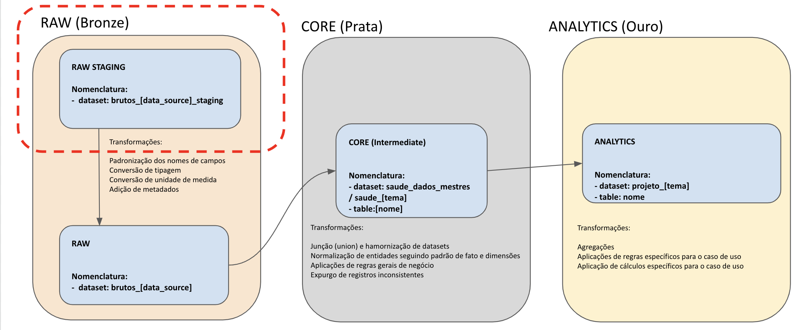

## Visão Geral

Os **pipelines de Extração e Carga de dados** são responsáveis por levar os dados até a primeira camada de dados dentro do **BigQuery**, a camada **bronze** (etapa *staging*):

Os nossos pipelines de extração e carga de dados são públicos e estão disponíveis nos seguintes repositórios:

- [Prefeitura do Rio - Pipelines SMS](https://github.com/prefeitura-rio/pipelines_rj_sms)
- [Pipelines - Prefect](https://github.com/prefeitura-rio/prefect_rj_iplanrio)

Para usar os repositórios, use a seguinte documentação: [Criação de pipelines](./criacao-de-pipelines)

---

## Conhecimentos Necessários

Para desenvolver um **pipeline de extração e carga de dados**, é necessário os seguintes conhecimentos:

- **Linguagem Python** para montar os scripts de extração e carga.
- **Versionamento de código** em *Git*.
- **Ferramenta Prefect** para orquestração dos scripts Python.

---

## Onde Aprender

Para aprender a extrair e carregar os dados no **Data Lake**, indicamos consumir o material desenvolvido pelo **Escritório de Dados**:

- [Desenvolvendo pipelines localmente](#)
- [Desenvolvendo pipelines na cloud](#)
