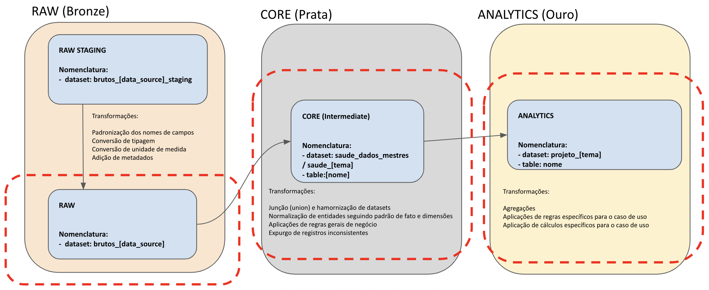

## Visão Geral

Os pipelines de transformação de dados são responsáveis por transitar os dados para além da camada **bronze** (etapa _staging_):

Os nossos modelos de dados são públicos e estão disponíveis no seguinte repositório:

<CardGroup cols={1}>
  <Card
    title="Modelos de Dados - IplanRio"
    icon="github"
    href="https://github.com/prefeitura-rio/queries-rj-iplanrio"
    horizontal={true}
    color="#000000"
  >
    Repositório com os modelos de dados desenvolvidos pela IplanRio.
  </Card>
</CardGroup>

---

## Conhecimentos Necessários

Para desenvolver um pipeline de transformação de dados, é necessário os seguintes conhecimentos:

- Linguagem SQL para transformar os dados nos formatos das camadas seguintes.
- Versionamento de código em Git.
- Ferramenta dbt para realizar a materialização das tabelas dentro do BigQuery.

---

## Onde Aprender

### SQL

Como em qualquer [SGBD](https://pt.wikipedia.org/wiki/Sistema_de_gerenciamento_de_banco_de_dados), a sintaxe SQL utilizada no BigQuery possui suas particularidades e funções específicas. Para conhecer mais, recomendamos utilizar a [documentação oficial do GoogleSQL](#).

<Tip>   
  💡 O BigQuery também permite treino e escoragem de modelos de Machine
  Learning a partir de instruções SQL! Essa é uma excelente alternativa ao uso
  de Spark devido à alta capacidade computacional do BigQuery e à facilidade
  da linguagem SQL. Para aprender sobre como implementar seus modelos a partir
  do BigQuery, consultar a [documentação oficial do BigQuery ML](#).{" "}
</Tip>

### dbt

Para aprender a trabalhar com o dbt, indicamos consumir os treinamentos oficiais da empresa que desenvolve a solução:

- ****

<CardGroup cols={1}>
  <Card
    title="Curso introdutório - dbt Learn"
    icon="graduation-cap"
    href="https://courses.getdbt.com/courses/fundamentals"
    horizontal={true}
  >
    Curso introdutório ao dbt, com foco em modelagem de dados e boas práticas.
  </Card>
</CardGroup>

Para aqueles usuários que querem se aprofundar na ferramenta, indicamos fortemente outros dois módulos:

<CardGroup cols={2}>
  <Card
    title="Escrevendo SQL modular - dbt Learn"
    icon="graduation-cap"
    href="https://courses.getdbt.com/courses/refactoring-sql-for-modularity"
    horizontal={true}
  >
    Curso sobre boas práticas de escrita de SQL, com foco em modularização e reutilização de código.
  </Card>
    <Card
    title="Métodos avançados para testar seus pipelines - dbt Learn"
    icon="graduation-cap"
    href="https://courses.getdbt.com/courses/advanced-testing"
    horizontal={true}
  >
    Curso sobre boas práticas de testes em pipelines, com foco em testes automatizados e explicandos os diferentes testes no DBT.
  </Card>
</CardGroup>
