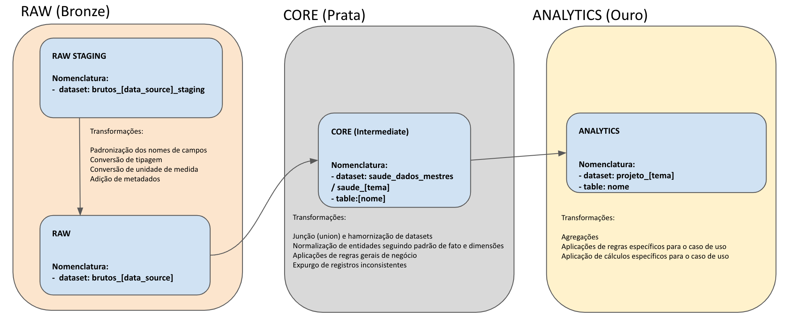

## Conjuntos de Dados (Datasets)

### Camadas de Consumos

#### Datasets organizados em camadas lógicas

Os dados em nosso BigQuery são organizado seguindo o padrão de design de dados conhecido como `Arquitetura Medalhão`. Este padrão consiste em organizar logicamente os dados em um Data Lake, com o objetivo de melhorar incremental e progressivamente a estrutura e qualidade dos dados à medida que eles fluem por cada camada da arquitetura (isto é, entre as tabelas da camada Bronze ⇒ Prata ⇒ Ouro):

- `Bronze ou Dados Brutos`: É onde depositamos todos os dados dos sistemas de origem externos. As estruturas de tabela nesta camada correspondem às estruturas de tabela do sistema de origem "como estão", juntamente com quaisquer colunas de metadados adicionais que capturem a data/hora de carga, o ID do processo, etc.
- `Prata ou Dados Mestres`: Nesta camada os dados da camada Bronze são correspondidos, unificados, padronizados e limpos ("o suficiente") para que a camada Prata possa fornecer uma "visão Institucional" de todas as suas principais entidades, conceitos e transações. Ela serve como uma fonte para os desenvolvedores criarem projetos e análises adicionais para resolver problemas de suas áreas.
- `Ouro ou Casos de Uso`: Os dados na camada Ouro geralmente são organizados em bancos de dados "específicos do projeto", prontos para o consumo. A camada Ouro é para relatórios ou dashboards, e utiliza modelos de dados mais desnormalizados (tabelões) e otimizados para leitura, com menos junções (joins).

#### Nomenclatura

| Camada                                              | Nomenclatura                                                                   | Comentário |
| --------------------------------------------------- | ------------------------------------------------------------------------------ | ---------- |
| 
Bronze ou _`Raw Staging`_
 | 
`brutos_<data_source>_staging` 
                      |            |
| 
Bronze ou _`Raw`_
         | 
`brutos_<data_source>` 
                              |            |
| 
Prata ou _`Core`_
         | 
` saude_dados_mestres`     `saude_<tema> `
 |            |
| 
Ouro ou _`Analytics`_
     | 
`projeto_<tema>` 
                                    |            |

### Camada de Gerenciamento

Existe uma quarta camada lógica que utilizamos reservada para controlar a execução de processos internos (ex. dbt, reprocessamento, ...) e persistir resultados relacionados à execução ou situação dos processos internos do Data Lake (ingestão dos dados, disponibilidade da infraestrutura, ...). Esta camada reserva o prefixo `gerenciamento`. Nesta camada os datasets deve ser nomeados seguindo um dos padrões abaixo

- `gerenciamento__<ferramenta>`
- `gerenciamento__<finalidade>`

Em casos específicos, onde uma ferramenta tem diversas finalidades, o dataset pode ser quebrado por finalidade:

- `gerenciamento__<ferramenta>_<finalidade>`

### Camadas intermediárias de dados

Camadas intermediárias de dados, utilizadas exclusivamente para cálculos ou agregações que sejam um passo na construção das tabelas das camadas prata ou ouro, são proibidas de serem materializadas no Data Lake. Para isso, usar o recurso de materialização efêmera do dbt (ref. [https://docs.getdbt.com/docs/build/materializations](https://docs.getdbt.com/docs/build/materializations) ).

## Tabelas

Nomear tabelas é algo menos estruturado e, por isso, requer bom senso. Mas temos algumas regras:

- Se houver tabelas para diferentes entidades dentro do mesmo dataset, incluir a entidade no começo do nome. Exemplo: `episodio_assistencial_diagnostico`, `farmacia_estoque`.
- Não incluir a unidade temporal no nome. Exemplo: nomear `farmacia_estoque`, e não `farmacia_estoque_diario`.
- Deixar nomes no singular. Exemplo: `chamado`, e não `chamados`.

## Restrições Gerais de nomeação

Para mantermos uma consistência nas nomeações, são necessárias algumas restrições:

- Ter sempre 2 níveis de identificação do dado: dataset_id (nome do conjunto) + table_id (nome da tabela). Exemplo `saude_estoque.movimentacao`
- Ter todas letras minúsculas (inclusive siglas), sem acentos, conectados por \_
- Não incluir conectores como de, da, dos, e, a, em, etc.
- o sufixo `_serie_historica` é reservado para as tabelas que contenham a série histórica. Nos casos das tabelas onde essa característica não é explicitada no nome, o entendimento é que a tabela representa a situação atual.
- Não deve ser utilizado termos vagos como “Outros…”. Caso a categoria do seu conjunto não se encaixe em nenhuma das opções já existentes, é permitida a sugestão de novos termos.
- Nenhuma palavra deve ser repetida no dataset_id ou table_id (ex: `saude_estoque.posicao` deve ser usado, e não `saude_estoque.estoque_posicao`)
- O dataset_id pode ser ser nomeado como `saude_dados_mestres`, caso a tabela em questão seja uma dimensão referência para diversos temas no Data Lake.

## Referências

- [https://docs.dados.rio/guia-desenvolvedores/manual-estilo/](https://docs.dados.rio/guia-desenvolvedores/manual-estilo/)
- [https://basedosdados.github.io/mais/style_data/#conjuntos-de-dados-dataset_id](https://basedosdados.github.io/mais/style_data/#conjuntos-de-dados-dataset_id)
