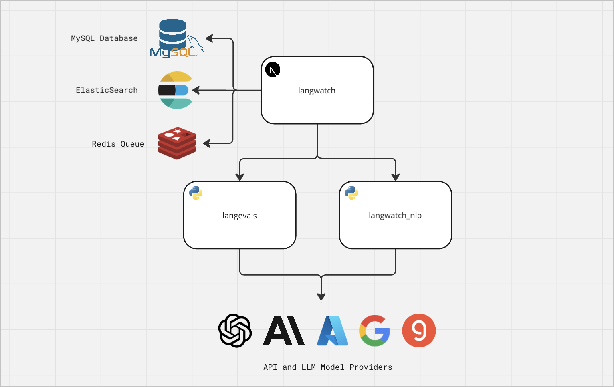

LangWatch is open-source and can be run locally or self-hosted using docker.

{/* 1. Copy the `langwatch/.env.example` file to `langwatch/.env`

2. Run `docker compose up --build` and open LangWatch at http://localhost:3000 */}


## Quickstart

You can have LangWatch fully running locally with 3 easy steps.

<Steps>
<Step title="Clone the repository">
First, clone LangWatch repository:

```bash
git clone https://github.com/langwatch/langwatch.git
```
</Step>
<Step title="Create the .env file">
Copy `langwatch/.env.example` to `langwatch/.env`, you can customize it later on.
</Step>
<Step title="Run the application">
```bash
docker compose up --build
```

Open LangWatch at http://localhost:3000
</Step>
</Steps>

## Architecture

To understand how all the different pieces of the LangWatch platform connect together, here is an outline of the architecture:



When you start up docker compose for running LangWatch, the six components listed below are started. When hosting in your own
infrastructure, be sure to have them running and properly connected with the main application by setting the correct env vars.

#### LangWatch

LangWatch is the main application, it's a NextJS application that servers both the frontend and backend of the platform.

#### MySQL

MySQL is our primary database, used for example for storing user, projects, saved datasets and settings.

#### ElasticSearch

ElasticSearch powers LangWatch capability to scale to hundreds of millions of messages for observability. It stores the messages,
metrics, spans, events, evaluation results, doing search, filtering and analytics.

#### Redis

Redis is used for LangWatch queues, for processing and retrying messages and evaluations in the background.

#### LangEvals

[LangEvals](https://github.com/langwatch/langevals) is the platform that powers LangWatch evaluators and guardrails, a Python service
that connects with other APIs and LLMs for running evaluations.

#### LangWatch NLP

LangWatch NLP is the python backend service that proxies the playground LLM calls, processes sentiment analysis and runs the topic clustering algorithm.


## Environment Variables

The default env vars already gets you up and running with the platform, but to make sure all features of LangWatch work properly,
set up the environment variables as shown on the [.env.example](https://github.com/langwatch/langwatch/blob/main/langwatch/.env.example) file.

#### Basic Configuration

| Env Var | Description |
| -------- | ----------- |
| NODE_ENV | Define the environment you are running in, you can change this to production for a production deployment |
| BASE_HOST | Define the base host for the application, this is the hostname and port of the application |
| DEBUG | This is a comma separated list of the namespaces of the messages you want to print following npm `debug` library standard |

#### Authentication

| Env Var | Description |
| -------- | ----------- |
| NEXT_PUBLIC_AUTH_PROVIDER | LangWatch uses next-auth for authentication, either `email` or `auth0` |
| NEXTAUTH_SECRET | This is the key used to encrypt cookie keys, be sure to change it before deploying to production |
| AUTH0_CLIENT_ID | Client ID in case you choose to configure auth0 as the authentication provider |
| AUTH0_CLIENT_SECRET | Client secret in case you choose to configure auth0 as the authentication provider |
| AUTH0_ISSUER | Issuer in case you choose to configure auth0 as the authentication provider |

#### Services and Infrastructure

| Env Var | Description |
| -------- | ----------- |
| DATABASE_URL | MySQL connection string for primary data storage |
| ELASTICSEARCH_NODE_URL | ElasticSearch connection string for observability data |
| REDIS_URL | Redis connection string for queue processing |
| LANGWATCH_NLP_SERVICE | LangWatch NLP service endpoint |
| LANGEVALS_ENDPOINT | LangEvals service endpoint |
| GOOGLE_APPLICATION_CREDENTIALS | Google credentials with access to DLP services, used for automatically redacting PII in traces and spans |
| SENDGRID_API_KEY | Sendgrid API key for sending emails |

#### Model Providers

| Env Var | Description |
| -------- | ----------- |
| OPENAI_API_KEY | OpenAI API key for embeddings and GPT-class LLMs |
| AZURE_OPENAI_ENDPOINT | Azure OpenAI endpoint for embeddings and GPT-class LLMs |
| AZURE_OPENAI_API_KEY | Azure OpenAI API key for embeddings and GPT-class LLMs |
| GOOGLE_APPLICATION_CREDENTIALS | Google Cloud credentials for Gemini-class LLMs |
| VERTEXAI_PROJECT | Google VertexAI project for Gemini-class LLMs |
| VERTEXAI_LOCATION | Google VertexAI location for Gemini-class LLMs |
| ANTHROPIC_API_KEY | Anthropic API key for Claude-class LLMs |
| GROQ_API_KEY | Groq API key for Llama 3, Mixtral and other open-source LLMs with top inference speed


## Support

If you need more support on the next steps for the production self-hosting installation on your cloud provider, reach out to our us.

#### Email Support

If you are prefer direct assistance from our team with the self-hosting installation, you can reach out to our support team via email at support@langwatch.ai.

#### Discord Channel

You can also join our [Discord](https://discord.gg/kT4PhDS2gH) channel and ask questions directly for the community and the core team.